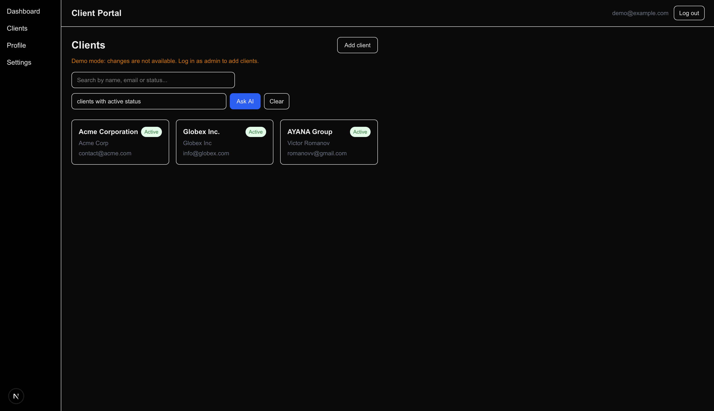
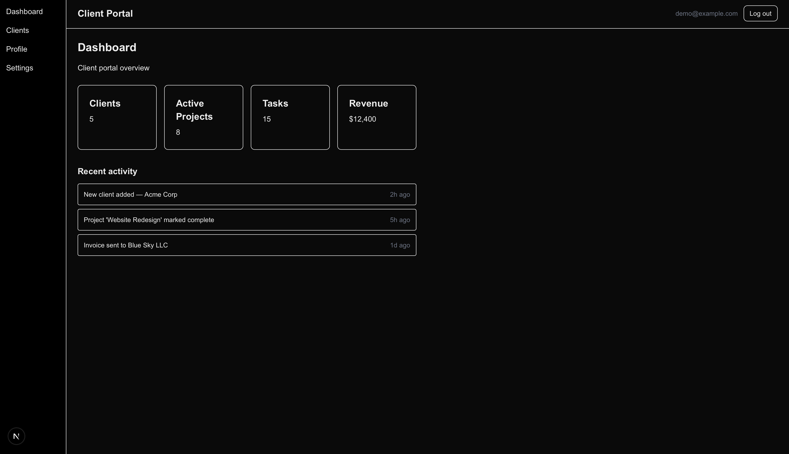
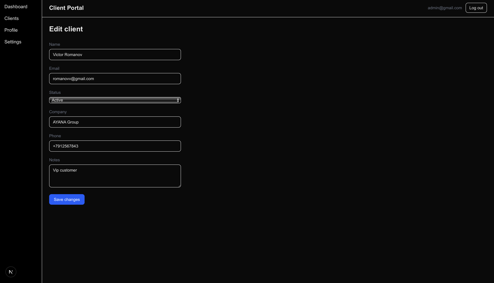

# Client Management Portal for Service Agencies

## Business Problem

Service agencies (marketing, dev shops, consultancies) juggle dozens of clients across spreadsheets, email threads, and someone's memory. There's no single place to see who's active, who's gone quiet, or who a specific contact belongs to — and no easy way to let a teammate or reviewer look at client data without giving them full edit access.

This portal centralizes client records behind real authentication, gives read-only vs. full-access roles instead of "everyone can edit everything," and adds a natural-language search so finding "clients with pending status" doesn't require scrolling or exact keyword matches.

**Live demo:** https://ai-client-portal-sooty.vercel.app/

**Demo login (read-only):** `demo@example.com` / `test12345`
Admin credentials exist and are available on request — not published here, since admin can add/edit/delete client records.





## Features

- **Authentication** — Supabase Auth, email/password. No public sign-up: two roles only, `admin` (full access) and `demo` (read-only), created manually. Unauthenticated visitors are redirected to the login page for every route.
- **Clients** — list with instant search (name, email, status), individual client detail pages, add/edit forms restricted to admin. Demo users see the same buttons but get a clear "demo mode, changes disabled" message instead of a confusing permissions error.
- **Row Level Security** — enforced at the database level, not just in the UI: even a direct API call with a demo user's session token can only read data, never write it. Verified manually via the Supabase REST API, not just assumed.
- **AI Smart Filter** — natural-language client search ("who's marked pending", "clients with no company listed") backed by Google's Gemini API through a server-side route (`app/api/smart-filter`). The API key never reaches the browser.
- **Dashboard** — client count pulled live from the database.
- **Profile** — shows the actual logged-in user's email, role, and account creation date instead of placeholder data.
- **Settings** — toggleable preferences (email notifications, new client alerts, newsletter).
- Custom "not found" state for invalid client IDs.
- Fully responsive layout with a collapsible sidebar on mobile.

## Known Limitations

This is a Sprint 1 portfolio build, not a production system — scope was intentionally kept tight:

- **Dashboard stats are partly mocked.** Only the "Clients" count is live from the database; "Active Projects," "Tasks," "Revenue," and the "Recent activity" feed are still static placeholder values, since there's no projects/tasks/invoices data model yet.
- **Client data is fictional** (Acme Corp, Globex Inc., etc.) — this isn't connected to any real agency's records.
- **Single tenant.** There's no concept of multiple agencies/organizations — one `clients` table, one set of users.
- **The read-only demo account won't show the admin flow** (add/edit client forms) — admin credentials are available on request.

## Tech Stack

- [Next.js](https://nextjs.org/) 16 (App Router)
- [React](https://react.dev/) 19 / [TypeScript](https://www.typescriptlang.org/)
- [Tailwind CSS](https://tailwindcss.com/)
- [Supabase](https://supabase.com/) — Postgres, Auth, Row Level Security
- [Google Gemini API](https://ai.google.dev/) (`gemini-3.5-flash`, free tier) for the AI Smart Filter

## Project Structure

```
app/
├── login/                  # Login page + server action
├── (portal)/               # Everything behind auth, wrapped in the shared layout
│   ├── dashboard/
│   ├── clients/             # List, detail, add/edit (admin-gated), server actions
│   ├── profile/
│   └── settings/
└── api/
    └── smart-filter/        # Server-side route calling the Gemini API
lib/
├── supabase/                # Browser client, server client, and the auth proxy
└── ai/                      # Gemini client wrapper
proxy.ts                     # Route protection — redirects unauthenticated requests to /login
```

## Getting Started

Clone the repository and install dependencies:

```bash
git clone https://github.com/msparvatkina-collab/ai-client-portal.git
cd ai-client-portal
npm install
```

Create a `.env.local` in the project root:

```
NEXT_PUBLIC_SUPABASE_URL=your_supabase_project_url
NEXT_PUBLIC_SUPABASE_PUBLISHABLE_KEY=your_supabase_publishable_key
GEMINI_API_KEY=your_gemini_api_key
```

You'll need your own free [Supabase](https://supabase.com/) project — run [`supabase/schema.sql`](./supabase/schema.sql) in the SQL Editor to create the `clients` table and RLS policies — and a free [Gemini API key](https://aistudio.google.com/apikey). Since there's no public sign-up, create at least one user manually in the Supabase dashboard (and mark one as `admin` per the comment at the bottom of `schema.sql`) to log in with.

Run the development server:

```bash
npm run dev
```

Open [http://localhost:3000](http://localhost:3000) in your browser.
